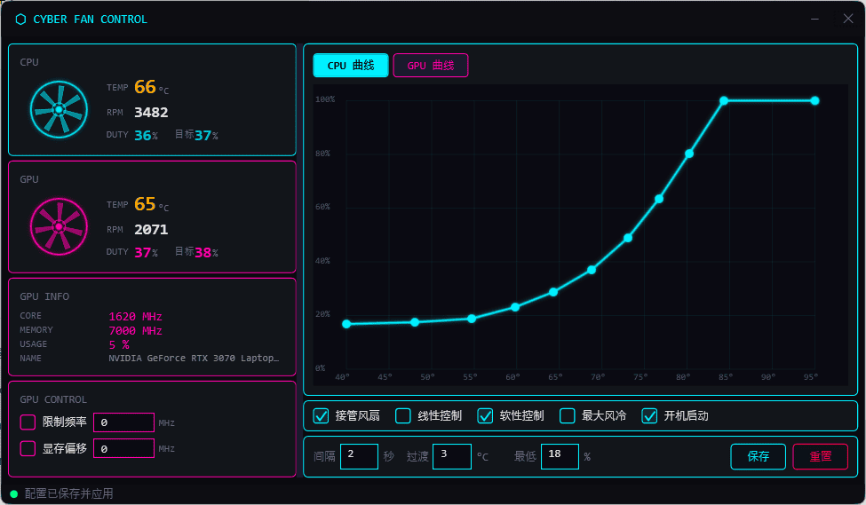

# CyberFanControl

Clevo 蓝天笔记本风扇控制台（WPF / .NET 8）

基于原版 [MyFanControl](https://github.com/xl-Synapse/MyFanControl) 的 C++/MFC 实现重写为 WPF 赛博风格界面，修复了原版多项逻辑缺陷并扩展了 GPU 控制。



## 功能特性

- 实时监控 CPU/GPU 温度、风扇转速与占空比
- CPU / GPU 独立温度-占空比曲线编辑器（点击添加、拖动调整、**右键删除**）
- **线性 / 阶梯**两种插值模式
- **软性控制 / 硬性控制**两种驱动模式
- 最大风冷（强制 100%）、温度平滑（升温立即、降温延迟）
- GPU 核心频率锁定、显存偏移超频
- 系统托盘、开机自启（计划任务）、单实例保护、睡眠恢复自动重应用

## 系统要求

- Windows 10/11
- .NET 8.0 Desktop Runtime
- 蓝天（Clevo）系列笔记本（需 `ClevoEcInfo.dll` + NTPortDrv 驱动）
- NVIDIA GPU（可选，需 `NVGPU_DLL.dll`）
- 管理员权限

## 构建

```bash
dotnet build -c Release
```

构建产物在 `bin/Release/net8.0-windows/`。将 `ClevoEcInfo.dll`、`NVGPU_DLL.dll` 放到 exe 同目录即可运行。

> 开发调试可用 `build.bat`（Debug 构建）和 `start.bat`（启动 Debug 产物）。

## 使用说明

### 基本操作

1. 主界面左侧显示 CPU/GPU 温度、转速、当前与目标占空比
2. 在右侧曲线编辑器中编辑温度-占空比映射
3. 勾选「接管风扇」启用自定义控制
4. 点击「保存」持久化并应用设置

### 曲线编辑器

| 操作 | 效果 |
|------|------|
| 空白处**左键点击** | 添加控制点（最小温度间距 1°C，上限 30 点，超限替换最近点） |
| **拖动**控制点 | 调整该点温度/占空比（受相邻点约束，保持有序） |
| 控制点**右键点击** | 删除该点（至少保留 2 个点） |
| 顶部 CPU / GPU 标签 | 切换编辑的曲线 |

### 控制选项

| 选项 | 说明 |
|------|------|
| 接管风扇 | 启用自定义风扇转速控制（关闭则交还 EC 自动模式） |
| 线性控制 | 在温度阈值间平滑插值；关闭则为阶梯式（取下界点占空比） |
| 软性控制 | 后台 100ms 周期逐步逼近目标转速，避免突变；关闭则每次刷新立即写入 |
| 最大风冷 | 跳过曲线，强制 CPU/GPU 风扇 100% |
| 开机启动 | 创建计划任务，登录后延迟 10 秒以最高权限运行 |

### 软性控制 vs 硬性控制

- **硬性控制**（默认）：每个刷新周期（「间隔」秒）算出目标占空比后**立即写入** EC。响应快，但温度波动时转速可能跳变。
- **软性控制**：仅计算目标，由后台线程用自适应步长（差距≤5% 时 1%/步，更大时最快 5%/步）渐进逼近。过渡平滑、噪音小。
  - 重新接管时从实读转速播种起步值，避免从陈旧值突跳
  - 目标稳定后每秒重写一次，防止 EC 被其它程序抢占
  - GPU 温度无效时暂停 GPU 软控制，保持当前转速而非用陈旧目标误驱动

### 参数

- **间隔（秒）**：状态刷新与控制周期，范围 1–60
- **过渡（°C）**：降温延迟阈值。降温时温度读数需下降超过该值才下调占空比，防止短暂波动；升温立即跟随
- **最低（%）**：发送给 EC 的最低占空比（默认 18，部分 EC 低于 18% 不执行手动 PWM）

### 开机自启动

- 通过计划任务 `CyberFanControl` 实现，登录后延迟 10 秒以最高权限运行
- 勾选创建任务，取消勾选删除任务
- 旧版使用的注册表 `HKCU\...\Run` 项会在新版启动时自动清理

## 项目结构

```
CyberFanControl/
├── App.xaml / App.xaml.cs        # 应用入口、单实例、托盘唤起
├── app.manifest                  # 要求管理员权限
├── Views/
│   ├── MainWindow.xaml           # 主窗口（赛博风格 UI）
│   └── MainWindow.xaml.cs        # 交互逻辑、曲线编辑、自启管理
├── Models/
│   └── FanData.cs                # FanStatus / ConfigProfile / TemperaturePoint
├── Services/
│   ├── NativeInterop.cs          # ClevoEcInfo.dll / NVGPU_DLL.dll P/Invoke
│   ├── HardwareService.cs        # 风扇控制核心、曲线计算、软/硬控制
│   └── TrayIcon.cs               # 纯 P/Invoke 系统托盘（无 WinForms 依赖）
├── Controls/
│   └── CyberDialog.cs            # 自定义确认对话框
├── CyberFanControl.csproj
├── build.bat / start.bat         # 构建与启动脚本
├── 故障排除.md                    # 常见问题排查
└── README.md
```

## 测试

项目包含 xUnit 单元测试 `CyberFanControl.Tests`，覆盖曲线计算、软/硬控制状态机、曲线点管理：

```bash
dotnet test
```

测试通过反射调用核心逻辑（不依赖硬件 DLL），验证：
- `CalculateDuty` 边界、阶梯/线性插值、点不足兜底、乱序排序
- 接管激活、GPU 温度无效时不误驱动、重激活从读数播种、睡眠恢复复位状态
- 曲线点数上限与最小间距约束

## 配置文件

配置保存为 exe 同目录的 `CyberFanControl.json`：

```json
{
  "Interval": 2,
  "TransitionTemp": 3,
  "MinFanDuty": 18,
  "TakeOver": false,
  "Linear": true,
  "SoftControl": false,
  "ForceCool": false,
  "LockGpuFreq": false,
  "GpuFreqLimit": 0,
  "LockMemOverclock": false,
  "GpuMemOffset": 0,
  "CpuCurve": [
    { "Temperature": 45, "DutyPercent": 18 },
    { "Temperature": 50, "DutyPercent": 20 }
  ],
  "GpuCurve": [
    { "Temperature": 45, "DutyPercent": 18 },
    { "Temperature": 50, "DutyPercent": 20 }
  ]
}
```

运行日志写入同目录的 `CyberFanControl.log`。

## 注意事项

⚠️ **警告**: 此软件直接控制硬件，请谨慎使用GPU 限制功能

1. 仅支持蓝天笔记本（Clevo 系列），需先安装 NTPortDrv 驱动
2. 需管理员权限访问硬件
3. 退出程序时自动恢复风扇默认设置（EC 自动模式）
4. GPU 频率/显存偏移为硬件级操作，错误参数可能导致黑屏，修改前会弹窗确认
5. 建议在使用前备份原始配置

## 许可证

MIT License

## 致谢

- 原作者: [贴吧大神](https://tieba.baidu.com/p/5971634018)
- 原仓库: [xl-Synapse/MyFanControl](https://github.com/xl-Synapse/MyFanControl)
